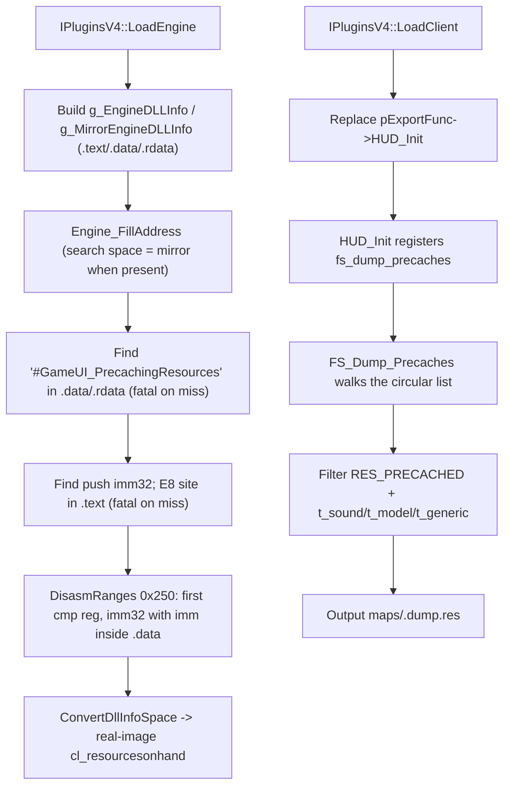

# Game-private symbols used by `PrecacheManager`

This document inventories the unexported game functions and private global-variable slots that `Plugins/PrecacheManager` locates and consumes. The plugin resolves exactly one game-private object at runtime — the `cl_resourcesonhand` resource-list head — through a legacy string-anchor + pattern + bounded-disassembly chain; the `private_funcs_t` function table is declared but never wired.

## Scope and shared resolution process
- The scope covers the single game-private global slot `cl_resourcesonhand` recovered by `privatehook.cpp`, plus the ABI-critical local re-declarations of the engine's `resource_t` / `resourcetype_t` types. The plugin does **not** hook any game-private function and installs no inline hooks.
- The `HUD_Init` takeover is a client export-table replacement done in `IPluginsV4::LoadClient` (`Plugins/PrecacheManager/plugins.cpp:61-66`), not private-symbol hooking, and is therefore out of scope.
- Public MetaHook APIs, saved engine interfaces, and ordinary plugin state (for example `g_EngineDLLInfo`, `g_MirrorEngineDLLInfo`, `g_iEngineType`, `g_dwEngineBuildnum`) are excluded.
- `IPluginsV4::LoadEngine` (`Plugins/PrecacheManager/plugins.cpp:29-59`) builds section info for the loaded engine image and, when available, the mirror image, then calls `Engine_FillAddress(mirror if present else real, real)`. All pattern searches run in the search space (mirror copy preferred); the recovered `.data` immediate is mapped back to the real image through `ConvertDllInfoSpace` (`Plugins/PrecacheManager/privatehook.cpp:61-72`) by RVA.
- Locating is fully **legacy** (signature scanning + bounded capstone walk); there is no `ResolveGameSymbol` / gamedata involvement, in contrast to `ResourceReplacer` (migrated 2026-09-06) and the launcher's `metahook.cpp` (partially migrated 2026-08-30). Notably, the `"#GameUI_PrecachingResources"` string anchor that was removed from `ResourceReplacer` during its gamedata migration is still the active anchor here.
- Failure gates: the anchor-string and `push; call` pattern searches are fatal — `Sig_VarNotFound` (`Plugins/PrecacheManager/plugins.h:20-21`) expands to `Sys_Error` with the engine buildnum via `g_pMetaHookAPI->SysError`. The disassembly stage has **no** explicit gate: if no qualifying `cmp` is found, `cl_resourcesonhand` silently stays `NULL` and the failure is deferred to the first null dereference inside `FS_Dump_Precaches`.

## Private variables and internal tables

| Local symbol / inferred game object | Declaration location | Resolution code range and mechanism | Subsequent use |
| --- | --- | --- | --- |
| `cl_resourcesonhand` (address of the engine's global `resource_t` sentinel node heading the client on-hand precache-resource circular doubly-linked list) | `Plugins/PrecacheManager/privatehook.h:36` (extern), defined at `Plugins/PrecacheManager/exportfuncs.cpp:18` | `Engine_FillAddress` (`Plugins/PrecacheManager/privatehook.cpp:8-59`), three stages: (1) `privatehook.cpp:12-16` finds `"#GameUI_PrecachingResources"` in `.data` with `.rdata` fallback (`Search_Pattern_Data` / `Search_Pattern_Rdata`), fatal on miss; (2) `privatehook.cpp:17-21` patches the string VA into the `push imm32; call` pattern (`68 ?? ?? ?? ?? E8`) and finds its `.text` reference, yielding the push instruction inside the engine's `CL_PrecacheResources`, fatal on miss; (3) `privatehook.cpp:31-57` runs `DisasmRanges` over the following `0x250` bytes and takes the first `cmp reg, imm32` whose immediate lies within the search-space `.data` bounds, mapping it into the real image via `ConvertDllInfoSpace`. The walk stops early on the match, on `int3` (`0xCC`) padding, or on `ret`. | `FS_Dump_Precaches` (`Plugins/PrecacheManager/exportfuncs.cpp:47-83`) dereferences the sentinel as a node: iterates from `cl_resourcesonhand->pNext` until the walk returns to the sentinel, keeps entries with `RES_PRECACHED` and type `t_sound` / `t_model` (skipping `*`-prefixed submodels) / `t_generic`, and writes them to `maps/<mapname>.dump.res` when the `fs_dump_precaches` command runs. |

## Private functions

| Local symbol / inferred game symbol | Declaration location | Resolution mechanism | Subsequent use |
| --- | --- | --- | --- |
| `gPrivateFuncs.CL_PrecacheResources` (`CL_PrecacheResources`, the engine's resource-precaching routine) | `Plugins/PrecacheManager/privatehook.h:3-6` (`private_funcs_t`), instance zero-initialized at `Plugins/PrecacheManager/privatehook.cpp:6` | **None in the current version.** The field is never assigned, called, or hooked; no function entry is recovered and the `Sig_FuncNotFound` / `Install_InlineHook` macros (`Plugins/PrecacheManager/plugins.h:22,35`) are unused. The engine routine is only implicated as the code neighborhood that the `#GameUI_PrecachingResources` push site and the `cmp cl_resourcesonhand` instruction live in. | None; retained as scaffolding for a future hook. |

## Private ABI types re-declared locally
- `resourcetype_t` (`Plugins/PrecacheManager/privatehook.h:8-17`) and `resource_s` / `resource_t` (`privatehook.h:19-34`) are local copies of the engine's resource-node layout (shared copy at `include/HLSDK/engine/custom.h:40,62`); they define how the walked list nodes are read, so they must track the engine ABI.
- `RES_PRECACHED` is taken from the shared `include/HLSDK/engine/custom.h:58` header rather than re-declared.

## Plugin-owned helper state

| Local state | Source and meaning | Use |
| --- | --- | --- |
| `gPrivateFuncs` | `Plugins/PrecacheManager/privatehook.cpp:6`, the plugin's private-function table. | Currently dead: only the never-assigned `CL_PrecacheResources` field exists. |
| `GetVFunctionFromVFTable` | `Plugins/PrecacheManager/privatehook.cpp:74-95`, a helper that maps a vtable function pointer across mirror / real / output `DllInfo` spaces. | Unused in the current version; retained alongside `gPrivateFuncs` as template capability. Neither is an engine symbol. |

## Architecture

## Dependencies
- `Plugins/PrecacheManager/plugins.cpp` - builds engine/mirror image metadata and invokes `Engine_FillAddress`; takes over `HUD_Init` in `LoadClient`.
- `Plugins/PrecacheManager/exportfuncs.cpp` - defines `cl_resourcesonhand` and consumes it in `FS_Dump_Precaches`.
- MetaHook APIs `GetEngineType`, `GetEngineBuildnum`, `GetEngineBase` / `GetEngineSize`, `GetMirrorEngineBase` / `GetMirrorEngineSize`, `GetSectionByName`, `SearchPattern`, `DisasmRanges`, and `SysError`.
- Capstone `cs_insn` operand matching inside the `DisasmRanges` callback.
- Shared HLSDK header `include/HLSDK/engine/custom.h` (`RES_PRECACHED`).

## Notes
- The single located symbol is a **data slot**, not a function: the plugin never detours or patches anything in the engine image; its only write path is the `.dump.res` output file.
- `cl_resourcesonhand` is the address of the sentinel node itself (the engine global is a `resource_t` value, not a pointer); iteration starts at `.pNext` and terminates when the walk returns to the sentinel address.
- Only the two pattern-search stages are fatal-gated. A `cmp`-extraction miss inside `DisasmRanges` leaves `cl_resourcesonhand == NULL` without any diagnostic, deferring the failure to the first `fs_dump_precaches` invocation (null dereference).
- gamedata migration status (as of 2026-09-06): not migrated. A future migration would replace stages (1)-(3) with `ResolveGameSymbol("cl_resourcesonhand")`; no such gamedata entry is required by `scripts/validate-gamedata.py` today.
- `private_funcs_t` / `gPrivateFuncs` / `GetVFunctionFromVFTable` do not form a complete hook-installation path and are retained as unused scaffolding (consistent with the `PrecacheManager` overview note).

## Callers
- `IPluginsV4::LoadEngine` (`Plugins/PrecacheManager/plugins.cpp`) calls `Engine_FillAddress`.
- The console command system invokes `FS_Dump_Precaches` when the user runs `fs_dump_precaches`, registered by the `HUD_Init` replacement.
