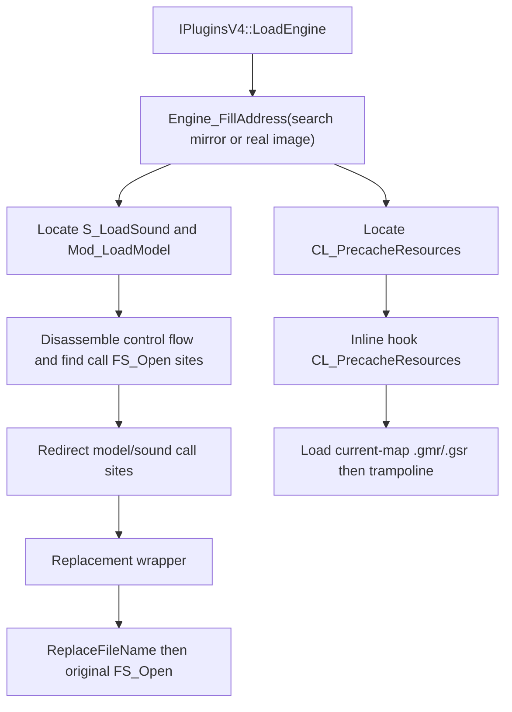

# Game-private symbols used by `ResourceReplacer`

This document inventories the unexported game functions that `Plugins/ResourceReplacer` resolves and consumes. Symbol names are the plugin's local `gPrivateFuncs` fields; the parenthetical names describe the inferred engine-side role rather than official debug-symbol names.

## Scope and shared resolution process

- The scope covers only game-private functions located by `privatehook.cpp`. The plugin does **not** locate or dereference any game-private global-variable slot.
- Public MetaHook APIs, saved engine interfaces, and ordinary plugin state (for example `g_EngineDLLInfo` and `g_iEngineType`) are excluded.
- `IPluginsV4::LoadEngine` builds information for the loaded engine image and, where available, a mirror image. `Engine_FillAddress` searches the mirror preferentially, then `ConvertDllInfoSpace` maps every located function and instruction address back to the real loaded image by RVA before use.
- A required function or `FS_Open` call site that cannot be found invokes `Sys_Error`; the plugin installs hooks only after all three resolution routines return.

## Private functions

| Local symbol / inferred game symbol | Declaration location | Resolution mechanism | Subsequent use |
| --- | --- | --- | --- |
| `gPrivateFuncs.S_LoadSound` (`S_LoadSound`) | `Plugins/ResourceReplacer/privatehook.h` | `Engine_FillAddress_S_LoadSound` first finds `"S_LoadSound: Couldn't load %s"` in `.data`/`.rdata`, matches its `push; call; add esp` reference in `.text`, then reverse-searches an owning function entry. If that fails, it uses engine-type-specific prologue signatures for SvEngine, HL25, regular GoldSrc (new/8308), and Blob engines. | Serves as the root of a bounded control-flow disassembly that finds calls to `FS_Open`; the function pointer itself is not directly called by this plugin. |
| `gPrivateFuncs.Mod_LoadModel` (`Mod_LoadModel`) | `Plugins/ResourceReplacer/privatehook.h` | `Engine_FillAddress_Mod_LoadModel` locates either the SvEngine error text `"Mod_LoadModel: Could not load"` or the GoldSrc text `"Mod_NumForName: %s not found"`, matches the `push; call; add esp` reference, and reverse-searches an `81 EC ...` or `55 8B EC` function start. | Serves as the second bounded control-flow-disassembly root used to find model-file `FS_Open` call sites; it is not directly invoked. |
| `gPrivateFuncs.FS_Open` (`FS_Open`) | `Plugins/ResourceReplacer/privatehook.h` | While walking `S_LoadSound` and `Mod_LoadModel`, the plugin identifies a pushed `"rb"` string in `.data`/`.rdata`, then takes a following near-`call` target within the expected instruction and byte distance. The first recovered target becomes `FS_Open`. Both walks follow immediate conditional/unconditional branches with a 1,000-instruction and depth-16 bound. | `S_LoadSound_FS_Open` and `Mod_LoadModel_FS_Open` call it after optionally substituting the requested filename. |
| `gPrivateFuncs.CL_PrecacheResources` (`CL_PrecacheResources`) | `Plugins/ResourceReplacer/privatehook.h` | `Engine_FillAddress_CL_PrecacheResources` finds `"#GameUI_PrecachingResources"` in `.data`/`.rdata`, matches `push <string>; call` in `.text`, and calls `ReverseSearchFunctionBegin` within 0x50 bytes. | Installed as a normal inline hook. Its replacement loads the current map's `.gmr` model list and `.gsr` sound list, then calls the trampoline retained in this field. |

## Plugin-owned call-site state

| Local state | Source and meaning | Use |
| --- | --- | --- |
| `S_LoadSound_call_FS_Open` | `Plugins/ResourceReplacer/privatehook.cpp` stores real-image addresses of the `call FS_Open` instructions found during the `S_LoadSound` walk. | `Engine_InstallHooks` redirects each branch to `S_LoadSound_FS_Open`. |
| `Mod_LoadModel_call_FS_Open` | Same, for `Mod_LoadModel`. | `Engine_InstallHooks` redirects each branch to `Mod_LoadModel_FS_Open`. |
| `g_phook_CL_PrecacheResources` | Plugin-local inline-hook handle, initially null. | Prevents duplicate installation and is unhooked by `IPluginsV4::ExitGame` through `Engine_UninstallHooks`. |

## Architecture

## Dependencies

- `Plugins/ResourceReplacer/plugins.cpp` - provides engine/mirror image metadata and invokes address filling and hook installation.
- `Plugins/ResourceReplacer/ResourceReplacer.cpp` - supplies model/sound replacement lists queried by the wrappers.
- MetaHook APIs `SearchPattern`, `ReverseSearchFunctionBegin[Ex]`, `DisasmRanges`, `InlinePatchRedirectBranch`, `InlineHook`, and `UnHook`.

## Notes

- The two branch-redirection hooks are patching individual private **call sites**, rather than detouring the entry points of `S_LoadSound` or `Mod_LoadModel`.
- `FS_Open` is resolved from the first qualifying call target. Both audio and model scans must still produce at least one call site; otherwise the plugin reports a fatal symbol-location failure.
- Only `CL_PrecacheResources` has a plugin-owned inline-hook handle. The call-site redirections have no corresponding handles in this module and are not explicitly restored by `Engine_UninstallHooks`.
- The resolver currently uses signature/string/disassembly scanning; unlike the migrated engine-core symbols documented in [[metahook-privatevars]], this plugin has no gamedata-backed `ResolveGameSymbol` path.

## Callers

- `IPluginsV4::LoadEngine` (`Plugins/ResourceReplacer/plugins.cpp`) calls `Engine_FillAddress` and `Engine_InstallHooks`.
- `IPluginsV4::ExitGame` calls `Engine_UninstallHooks`.
