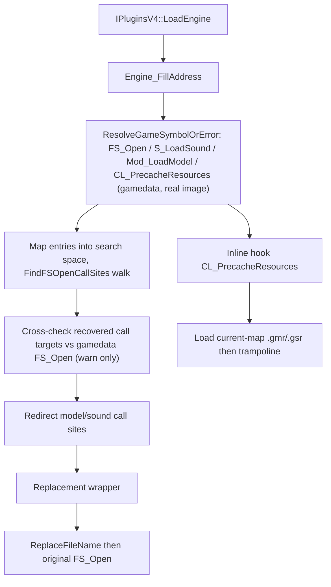

# Game-private symbols used by `ResourceReplacer`

This document inventories the unexported game functions that `Plugins/ResourceReplacer` resolves and consumes. Symbol names are the plugin's local `gPrivateFuncs` fields; the parenthetical names describe the inferred engine-side role rather than official debug-symbol names.

## Scope and shared resolution process
- The scope covers only game-private functions located by `privatehook.cpp`. The plugin does **not** locate or dereference any game-private global-variable slot.
- Public MetaHook APIs, saved engine interfaces, and ordinary plugin state (for example `g_EngineDLLInfo` and `g_iEngineType`) are excluded.
- `IPluginsV4::LoadEngine` builds information for the loaded engine image and, where available, a mirror image. All four function entries are resolved **gamedata-only** through `ResolveGameSymbolOrError` (MetaHook API 109 `ResolveGameSymbol` against the real engine module base `g_EngineDLLInfo.ImageBase`); a resolution failure prints a diagnostic (symbol name, engine buildnum, module CRC64, status string) and terminates via `Sys_Error`, mirroring the launcher's `MH_LoadEngine_ResolveSymbol` semantics. There is no signature/string/reverse-search fallback.
- The bounded capstone walks that discover `FS_Open` call sites still run in the search space (mirror copy when one exists); walk roots are mapped from real-image VAs via `ConvertDllInfoSpace(realVA, RealDllInfo, SearchDllInfo)`, and results are mapped back to the real image before hooking. The walks are functional core (the gamedata model cannot express intra-function call-instruction addresses), not a fallback.
- A required function or `FS_Open` call site that cannot be found invokes `Sys_Error`; the plugin installs hooks only after all resolution routines return.
## Private functions
| Local symbol / inferred game symbol | Declaration location | Resolution mechanism | Subsequent use |
| --- | --- | --- | --- |
| `gPrivateFuncs.S_LoadSound` (`S_LoadSound`) | `Plugins/ResourceReplacer/privatehook.h` | `ResolveGameSymbolOrError("S_LoadSound")` (gamedata-only, real-image VA). The entry is then mapped into the search space and used as the root of the shared bounded control-flow walk `FindFSOpenCallSites` (call window 0x30). | Root of the bounded disassembly that finds `FS_Open` call sites; the function pointer itself is not directly called by this plugin. |
| `gPrivateFuncs.Mod_LoadModel` (`Mod_LoadModel`) | `Plugins/ResourceReplacer/privatehook.h` | `ResolveGameSymbolOrError("Mod_LoadModel")` (gamedata-only). Same shared walk `FindFSOpenCallSites` with call window 0x50. | Second bounded-disassembly root for model-file `FS_Open` call sites; not directly invoked. |
| `gPrivateFuncs.FS_Open` (`FS_Open`) | `Plugins/ResourceReplacer/privatehook.h` | `ResolveGameSymbolOrError("FS_Open")` resolved once in `Engine_FillAddress` before the walks; gamedata is authoritative. Call targets recovered by the disassembly are **not** assigned — they are only cross-checked against the gamedata address, with a one-time `Con_DPrintf` warning on mismatch (never fatal). | `S_LoadSound_FS_Open` and `Mod_LoadModel_FS_Open` call it after optionally substituting the requested filename. |
| `gPrivateFuncs.CL_PrecacheResources` (`CL_PrecacheResources`) | `Plugins/ResourceReplacer/privatehook.h` | `ResolveGameSymbolOrError("CL_PrecacheResources")` (gamedata-only). | Installed as a normal inline hook. Its replacement loads the current map's `.gmr` model list and `.gsr` sound list, then calls the trampoline retained in this field. |

Both walks share one implementation (`FindFSOpenCallSites` in `privatehook.cpp`): identify a pushed `"rb"` string in `.data`/`.rdata`, then take following near-`call` sites within the configured byte window and a 5-instruction span, following immediate conditional/unconditional branches with a 1,000-instruction and depth-16 bound. A build-time `static_assert(METAHOOK_API_VERSION >= 109)` pins the required host API.
## Plugin-owned call-site state

| Local state | Source and meaning | Use |
| --- | --- | --- |
| `S_LoadSound_call_FS_Open` | `Plugins/ResourceReplacer/privatehook.cpp` stores real-image addresses of the `call FS_Open` instructions found during the `S_LoadSound` walk. | `Engine_InstallHooks` redirects each branch to `S_LoadSound_FS_Open`. |
| `Mod_LoadModel_call_FS_Open` | Same, for `Mod_LoadModel`. | `Engine_InstallHooks` redirects each branch to `Mod_LoadModel_FS_Open`. |
| `g_phook_CL_PrecacheResources` | Plugin-local inline-hook handle, initially null. | Prevents duplicate installation and is unhooked by `IPluginsV4::ExitGame` through `Engine_UninstallHooks`. |

## Architecture

## Dependencies
- `Plugins/ResourceReplacer/plugins.cpp` - provides engine/mirror image metadata and invokes address filling and hook installation.
- `Plugins/ResourceReplacer/ResourceReplacer.cpp` - supplies model/sound replacement lists queried by the wrappers.
- MetaHook APIs `ResolveGameSymbol`, `GetModuleCRC64`, `GetGameSymbolStatusString` (gamedata, API 109), `DisasmRanges`, `GetNextCallAddr`, `InlinePatchRedirectBranch`, `InlineHook`, and `UnHook`.
## Notes
- The two branch-redirection hooks are patching individual private **call sites**, rather than detouring the entry points of `S_LoadSound` or `Mod_LoadModel`.
- `FS_Open` comes from gamedata and is authoritative. Both audio and model walks must still produce at least one call site; otherwise the plugin reports a fatal `Sys_Error("*.FS_Open not found")`.
- Only `CL_PrecacheResources` has a plugin-owned inline-hook handle. The call-site redirections have no corresponding handles in this module and are not explicitly restored by `Engine_UninstallHooks`.
- Migration status (2026-09-06, plan `docs/plans/resource-replacer-gamedata-migration-plan.md`): this plugin is now fully gamedata-backed via `ResolveGameSymbol` (first API-109 consumer among plugins). All legacy locators were removed: `"S_LoadSound: Couldn't load %s"` / `"Mod_LoadModel: Could not load"` / `"Mod_NumForName: %s not found"` / `"#GameUI_PrecachingResources"` string searches, `push; call; add esp` pattern matching, `ReverseSearchFunctionBegin[Ex]`, and the five engine-prologue signature macros (`S_LOADSOUND_SIG_*`).
- `scripts/validate-gamedata.py` `COMMON_REQUIRED` now gates these four symbols for every declared engine family, so an upstream snapshot dropping one fails at build time instead of runtime. svencoop-10257 windows RVAs: S_LoadSound 0x99080, Mod_LoadModel 0x51be0, FS_Open 0x4e8d0, CL_PrecacheResources 0x26540. Engines outside `ENGINE_FAMILIES` (cstrike/czero/czeror empty snapshots, GoldSrc 8308, no-gamedata installs) fail fast with the diagnostic `Sys_Error` — same behavior as the launcher.
## Callers

- `IPluginsV4::LoadEngine` (`Plugins/ResourceReplacer/plugins.cpp`) calls `Engine_FillAddress` and `Engine_InstallHooks`.
- `IPluginsV4::ExitGame` calls `Engine_UninstallHooks`.
