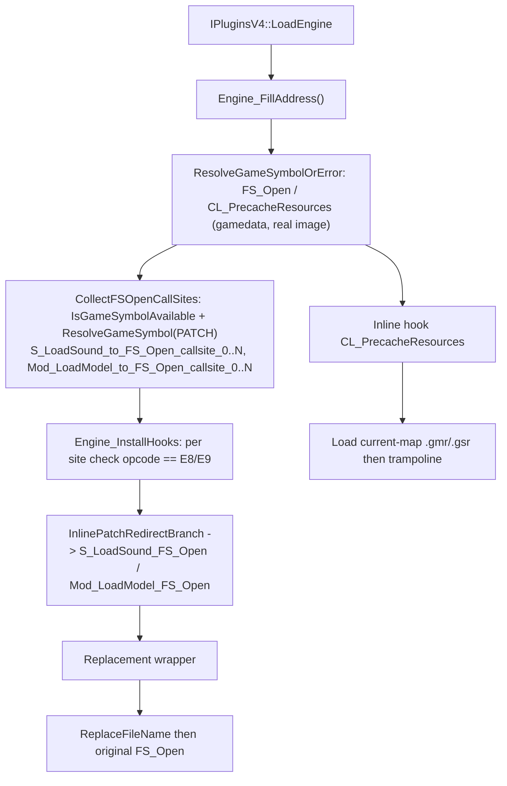

# Game-private symbols used by `ResourceReplacer`

This document inventories the unexported game functions and intra-function call instructions that `Plugins/ResourceReplacer` resolves and consumes. Symbol names are the plugin's local `gPrivateFuncs` fields; the parenthetical names describe the inferred engine-side role rather than official debug-symbol names.

## Scope and shared resolution process
- The scope covers two game-private functions (`FS_Open`, `CL_PrecacheResources`) plus the numbered gamedata PATCH records for the `FS_Open` call sites inside `S_LoadSound` and `Mod_LoadModel`. The plugin does **not** locate or dereference any game-private global-variable slot.
- Public MetaHook APIs, saved engine interfaces, and ordinary plugin state (for example `g_EngineDLLInfo`, `g_iEngineType`, `g_dwEngineBuildnum`) are excluded.
- `IPluginsV4::LoadEngine` calls `Engine_FillAddress()` (no arguments); the plugin no longer builds a mirror-image search space. Both function entries are resolved **gamedata-only** through `ResolveGameSymbolOrError` (MetaHook API 110 `ResolveGameSymbol` against the real engine module base `g_EngineDLLInfo.ImageBase`); a resolution failure prints a diagnostic (symbol name, engine buildnum, module CRC64, status string) and terminates via `Sys_Error`, mirroring the launcher's `MH_LoadEngine_ResolveSymbol` semantics. There is no signature/string/reverse-search fallback.
- Both call-site sets are consumed as contiguous numbered PATCH symbols: build `S_LoadSound_to_FS_Open_callsite_<n>` / `Mod_LoadModel_to_FS_Open_callsite_<n>` from 0, probe each with `IsGameSymbolAvailable`, then resolve with `ResolveGameSymbol(..., MH_GAMESYMBOL_KIND_PATCH, ...)`. Index 0 is required; the first `SYMBOL_NOT_FOUND` after index 0 ends the enumeration, while any other status aborts. The returned address is already a real-image VA used directly for redirection — no search-space mapping and no `base + rva` arithmetic in the plugin.
- Before each `InlinePatchRedirectBranch` call the plugin re-reads the target byte in real memory and accepts only `0xE8` / `0xE9` (five-byte `rel32` call / jmp encodings). A different opcode reports the PATCH symbol, address and opcode, then aborts without rewriting that site or installing further hooks. The check detects a rewritten opcode; it does not detect an existing `E8`/`E9` redirect installed by another plugin, and provides no concurrent-modification protection.
- A required function, a missing index-0 call site, a failed call-site redirect, or an opcode mismatch is fatal (`Sys_Error`); hooks are installed only after all resolution routines return. A build-time `static_assert(METAHOOK_API_VERSION >= 110)` pins the required host API (`IsGameSymbolAvailable`).

## Private functions
| Local symbol / inferred game symbol | Declaration location | Resolution mechanism | Subsequent use |
| --- | --- | --- | --- |
| `gPrivateFuncs.FS_Open` (`FS_Open`) | `Plugins/ResourceReplacer/privatehook.h` | `ResolveGameSymbolOrError("FS_Open", MH_GAMESYMBOL_KIND_FUNCTION)` resolved once in `Engine_FillAddress` before any call site; gamedata is authoritative. Call targets are not recovered by disassembly and are not cross-checked. | `S_LoadSound_FS_Open` and `Mod_LoadModel_FS_Open` call it after optionally substituting the requested filename. |
| `gPrivateFuncs.CL_PrecacheResources` (`CL_PrecacheResources`) | `Plugins/ResourceReplacer/privatehook.h` | `ResolveGameSymbolOrError("CL_PrecacheResources", MH_GAMESYMBOL_KIND_FUNCTION)` (gamedata-only). | Installed as a normal inline hook. Its replacement loads the current map's `.gmr` model list and `.gsr` sound list, then calls the trampoline retained in this field. |

`S_LoadSound` and `Mod_LoadModel` are **no longer resolved**: they were only scan roots for the removed call-site walk, and `gPrivateFuncs` no longer carries those fields.
## Plugin-owned call-site state

| Local state | Source and meaning | Use |
| --- | --- | --- |
| `g_S_LoadSound_FS_OpenCallSites` | `Plugins/ResourceReplacer/privatehook.cpp` stores `{symbolName, real-image address}` pairs resolved from `S_LoadSound_to_FS_Open_callsite_0..N`. | `Engine_InstallHooks` verifies the opcode and redirects each branch to `S_LoadSound_FS_Open`. |
| `g_Mod_LoadModel_FS_OpenCallSites` | Same, for `Mod_LoadModel_to_FS_Open_callsite_0..N`. | `Engine_InstallHooks` redirects each branch to `Mod_LoadModel_FS_Open`. |
| `g_phook_CL_PrecacheResources` | Plugin-local inline-hook handle, initially null. | Prevents duplicate installation and is unhooked by `IPluginsV4::ExitGame` through `Engine_UninstallHooks`. |

## Architecture

## Dependencies
- `Plugins/ResourceReplacer/plugins.cpp` - provides the real engine base and invokes address filling and hook installation.
- `Plugins/ResourceReplacer/ResourceReplacer.cpp` - supplies model/sound replacement lists queried by the wrappers.
- MetaHook APIs `ResolveGameSymbol`, `IsGameSymbolAvailable`, `GetModuleCRC64`, `GetGameSymbolStatusString` (gamedata, API 110), `InlinePatchRedirectBranch`, `InlineHook`, and `UnHook`.
## Notes
- The two branch-redirection hooks patch individual private **call sites** rather than detouring the entry points of `S_LoadSound` or `Mod_LoadModel`.
- `FS_Open` comes from gamedata and is authoritative; the two call-site sets come from gamedata too, so no disassembly is used to locate anything. Each set must contain at least `_0`, otherwise the plugin reports a fatal `Sys_Error` naming the missing PATCH symbol.
- Only `CL_PrecacheResources` has a plugin-owned inline-hook handle. The call-site redirections have no corresponding handles in this module and are not explicitly restored by `Engine_UninstallHooks`.
- Migration history: gamedata-only since 2026-09-06 (plan `docs/plans/resource-replacer-gamedata-migration-plan.md`), which removed the string searches (`"S_LoadSound: Couldn't load %s"`, `"Mod_LoadModel: Could not load"`, `"Mod_NumForName: %s not found"`, `"#GameUI_PrecachingResources"`), `push; call; add esp` pattern matching, `ReverseSearchFunctionBegin[Ex]`, and the `S_LOADSOUND_SIG_*` prologue macros. Issue #853 (2026-09-09) then removed the remaining transition layer: `FindFSOpenCallSites`, `FS_Open_SearchContext`, the `"rb"` string search and call-window walk, the disasm/gamedata cross-check warning, `ConvertDllInfoSpace`, the `S_LoadSound` / `Mod_LoadModel` resolutions, and the mirror-image (`g_MirrorEngineDLLInfo`) preparation. The `"rb"` comparison inside the two replacement wrappers is business logic and is retained.
- `scripts/validate-gamedata.py` gates `FS_Open` / `CL_PrecacheResources` (kind `function`) via `COMMON_REQUIRED` and both numbered call-site sets via `NUMBERED_PATCH_SETS`, for every declared engine family, so an upstream snapshot dropping one fails at build time instead of runtime. svencoop-10257 windows RVAs: FS_Open 0x4e8d0, CL_PrecacheResources 0x26540, S_LoadSound_to_FS_Open_callsite_0 0x16f790, Mod_LoadModel_to_FS_Open_callsite_0 0x12b9fd. Engines outside `ENGINE_FAMILIES` (cstrike/czero/czeror empty snapshots, no-gamedata installs) fail fast with the diagnostic `Sys_Error` — same behavior as the launcher.
## Callers

- `IPluginsV4::LoadEngine` (`Plugins/ResourceReplacer/plugins.cpp`) calls `Engine_FillAddress` and `Engine_InstallHooks`.
- `IPluginsV4::ExitGame` calls `Engine_UninstallHooks`.
