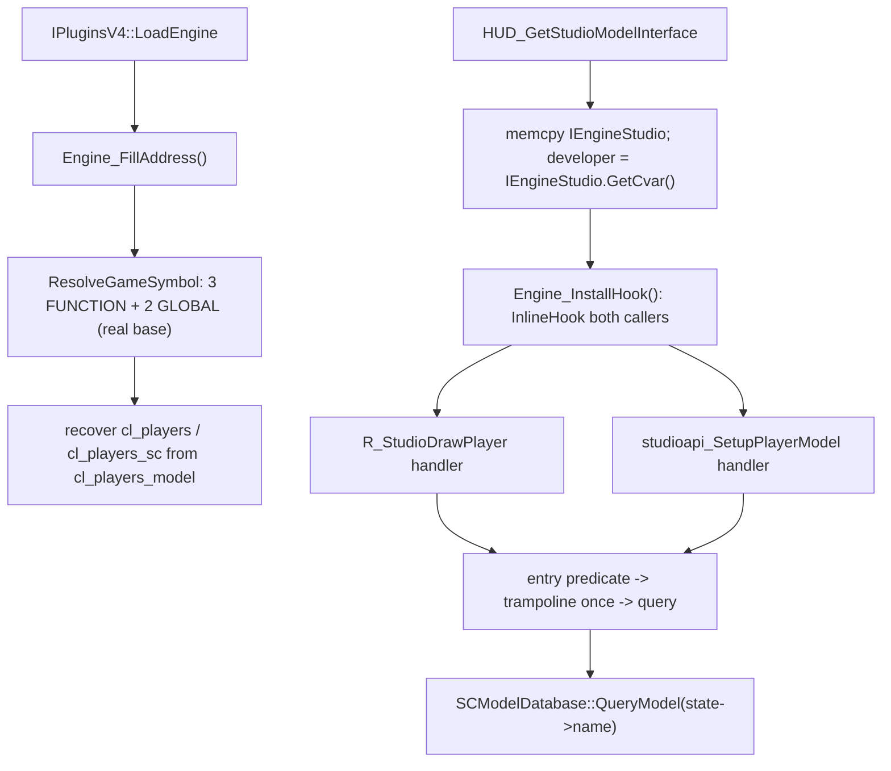

# Game-private symbols used by `SCModelDownloader`

This document inventories the unexported game symbols that `Plugins/SCModelDownloader` locates in the engine image and consumes. Since issue #855 (2026-09-09) the location is **gamedata-only** and the plugin no longer consumes `R_StudioChangePlayerModel`, its call sites, or any disassembly walk. Symbol names are the gamedata record names; the parenthetical names describe the inferred engine-side role.

## Scope and shared resolution process
- The scope covers five located items: the two player-model callers `R_StudioDrawPlayer` and `studioapi_SetupPlayerModel` (inline-hooked), the single-player predicate `Host_IsSinglePlayerGame`, the per-client state array `DM_PlayerState`, and the `cl.players[0].model` member address `cl_players_model`.
- Out of scope: the `HUD_*` export-table takeover (`IPluginsV4::LoadClient`) and the `serverbrowser.dll` -> `steam_api.dll!SteamAPI_Shutdown` IAT hook (`ServerBrowser_InstallHook` / `DllLoadNotification`, a third-party DLL import rather than an engine-private symbol). The public interfaces `engine_studio_api_t` / `r_studio_interface_t` are used only as public API (cvar lookup, `GetCurrentEntity`), not as anchors.
- Public MetaHook APIs, saved engine interfaces, and ordinary plugin state (`g_EngineDLLInfo`, `g_iEngineType`, `g_dwEngineBuildnum`, `gEngfuncs.GetMaxClients()`) are excluded.
- **gamedata-only**: every address comes from `g_pMetaHookAPI->ResolveGameSymbol(g_EngineDLLInfo.ImageBase, name, kind, &address)` against the **real** engine module base; no mirror-space conversion, signature search, string search, control-flow walk or call-site patch remains. `privatehook.cpp` carries `static_assert(METAHOOK_API_VERSION >= 109, ...)`; `scripts/validate-gamedata.py` gates all five symbols (plus the three functions) as common required symbols with expected kinds.
- Timing: `Engine_FillAddress` runs during `IPluginsV4::LoadEngine` and resolves all five symbols; the two inline hooks are installed later from `HUD_GetStudioModelInterface` **after** `memcpy(&IEngineStudio, pstudio, sizeof(IEngineStudio))` and after `developer` is fetched, so no handler can run against an uninitialised `IEngineStudio`.
- Failure is fatal and specific: a non-`MH_GAMESYMBOL_OK` status prints `Failed to resolve "<symbol>"` with buildnum, CRC64 (when available) and the status string, then aborts via `Sys_Error`.

## Private functions

| Local symbol / gamedata name | Declaration location | Resolution mechanism | Subsequent use |
| --- | --- | --- | --- |
| `gPrivateFuncs.R_StudioDrawPlayer` (`R_StudioDrawPlayer`, `int (int flags, entity_state_t *pplayer)`) | `Plugins/SCModelDownloader/privatehook.h` (`private_funcs_t`), instance zero-initialized at `privatehook.cpp` | `ResolveGameSymbol(..., "R_StudioDrawPlayer", MH_GAMESYMBOL_KIND_FUNCTION)` | `Install_InlineHook(R_StudioDrawPlayer)` from `Engine_InstallHook`; the plugin function (defined in `exportfuncs.cpp`) evaluates the entry predicate, calls the trampoline exactly once, then runs the download query and returns the trampoline's value. |
| `gPrivateFuncs.studioapi_SetupPlayerModel` (`studioapi_SetupPlayerModel`, `model_t *(int playerindex)`) | same | `ResolveGameSymbol(..., "studioapi_SetupPlayerModel", MH_GAMESYMBOL_KIND_FUNCTION)` | same pattern; the parameter index is used directly (the engine contract already requires a valid index). |
| `gPrivateFuncs.Host_IsSinglePlayerGame` (`Host_IsSinglePlayerGame`, `int (void)`) | same | `ResolveGameSymbol(..., "Host_IsSinglePlayerGame", MH_GAMESYMBOL_KIND_FUNCTION)` | Short-circuit operand of the trigger predicate: `(g_pDeveloper->value \|\| !Host_IsSinglePlayerGame()) && modelName[0]`. |

`R_StudioChangePlayerModel` is **no longer** located, resolved, patched or called. Its own inlining status and whether it exists as a standalone function no longer affect the plugin.

## Private global variables

| Local symbol / gamedata name | Declaration location | Resolution mechanism | Subsequent use |
| --- | --- | --- | --- |
| `DM_PlayerState` (`player_model_t DM_PlayerState[MAX_CLIENTS]`, element stride `0x20C`) | `Plugins/SCModelDownloader/privatehook.h` (extern), defined at `privatehook.cpp` as `player_model_t(*DM_PlayerState)[MAX_CLIENTS]` | `ResolveGameSymbol(..., "DM_PlayerState", MH_GAMESYMBOL_KIND_GLOBAL)` in `Engine_FillAddress` | Read/written by the plugin: the trigger predicate reads `[i].name` / `.model`; `SCModel_ReloadModel` / `SCModel_ReloadAllModels` clear `name[0]` and `model` to force a reload. Array-address semantics - never a pointer slot. |
| `cl_players_model` (`&cl.players[0].model`, the member address itself) | consumed in `Engine_FillAddress` (`privatehook.cpp`) | `ResolveGameSymbol(..., "cl_players_model", MH_GAMESYMBOL_KIND_GLOBAL)`; the returned address is the **member**, so the array head is recovered by subtracting `offsetof(player_info_t, model)`. Not a pointer slot, no extra dereference. | `g_iEngineType == ENGINE_SVENGINE` -> `cl_players_sc = (player_info_sc_t*)(modelAddress - offsetof(player_info_t, model))`; otherwise `cl_players = (player_info_t*)(...)`. |

Plugin-owned globals (not gamedata symbols) declared in `privatehook.cpp` with `extern` in `privatehook.h`: `player_info_t* cl_players` and `player_info_sc_t* cl_players_sc`; only the one matching the current engine is assigned.

## Layout / ABI contract (compile-time asserted in `privatehook.h`)

| Assertion | Value | Evidence |
| --- | --- | --- |
| `sizeof(player_model_t) == 0x20C` | 524 | `char name[260]; char modelname[260]; model_t* model;` matches the engine's `imul reg, 20Ch` stride. |
| `offsetof(player_info_t, model) == 0x130` | 304 | Upstream `find-cl_players_model.py`: `player_info_t.model` is at `+0x130` in every validated family (DWARF-verified on hl-8684 / hl-10210 hw.so). |
| `sizeof(player_info_sc_t) == 0x250` | 592 | Matches the SvEngine `cl.players` element stride reported by the upstream locator (`0x250` everywhere except WON `0x24C`); the plugin's `player_info_sc_t` is the base struct plus `hashedcdkey[16]` + `uint64 m_nSteamID`. |

`cl_players_model` is not a pointer slot: `MH_ResolveGameSymbol` returns `moduleBase + gv_rva` and the upstream `gv_va` is exactly `&cl.players[0].model`, so `modelAddress - offsetof(player_info_t, model)` is the array head.

## Trigger predicate and query timing

Both callers gate the same engine block on `(developer.value || !Host_IsSinglePlayerGame()) && cl.players[i].model[0]`, then compare `DM_PlayerState[i].name` against `cl.players[i].model` (case-sensitive `Q_strcmp(...) != 0`), else compare `DM_PlayerState[i].model` against `currententity->model`.

- The plugin rebuilds that predicate at the **caller entry**, before the engine mutates `DM_PlayerState`, so the result is identical to the engine's own test:
  - `playerModelName = (g_iEngineType == ENGINE_SVENGINE) ? cl_players_sc[i].model : cl_players[i].model`
  - `usesNamedModel = (g_pDeveloper->value || !gPrivateFuncs.Host_IsSinglePlayerGame()) && playerModelName[0]` (short-circuit preserved)
  - `usesNamedModel ? strcmp(DM_PlayerState[i].name, playerModelName) != 0 : DM_PlayerState[i].model != currentEntity->model`
- `R_StudioDrawPlayer` derives the index as `pplayer->number - 1` (never `currententity->index`, never the possibly-stale `r_playerindex`) and keeps the engine's bound semantics: outside `[0, gEngfuncs.GetMaxClients())` it reads no array and triggers no query, but still calls the trampoline once and returns its value. This is what makes the `deadplayer` path (called from `R_StudioDrawModel` with a copied `entity_state_t` whose `number` is the owner player, while `currententity` is the corpse) read the correct player.
- `studioapi_SetupPlayerModel` uses its parameter index directly (engine precondition: valid index).
- Both handlers snapshot `cl_entity_t* currentEntity = IEngineStudio.GetCurrentEntity()` at entry and pass it to the query, so the comparison uses the same entity the engine used and does not re-read changed globals after the call.
- Order per call: evaluate predicate -> call the original exactly once, saving the return value -> if triggered, `SCModel_OnPlayerModelChanged(i, currentEntity)` (reads the state the caller just wrote: `model == currentEntity->model || !model`, then non-empty `name[0]`, then `SCModel_AutoDownload()` -> `SCModelDatabase()->QueryModel(name)`) -> return the saved value unchanged.
- The entry never clears `state->name`, never writes `state->model`, never calls `Mod_ForName`; the `else`-branch `name[0] = 0` and the skin reset stay inside the original caller. Because the `else` branch clears the name before the change, the post-call query naturally skips it - same outcome as the old call-site wrapper.
- Query timing differs from the old design only in that `R_StudioDrawPlayer`'s query now runs after the whole draw function returns instead of inside the model-change block; the state read is unchanged (the caller does not modify `DM_PlayerState` after that block).
- Engine-side coverage: all four `R_StudioChangePlayerModel()` call sites in `engine/r_studio.c` (3183 / 3193 in `R_StudioDrawPlayer`, 5044 / 5054 in `studioapi_SetupPlayerModel`) sit inside the two hooked callers, so the caller-hook design loses no trigger path. The old wrapper only redirected the `SetupPlayerModel` sites, so the `R_StudioDrawPlayer` paths are a net addition.

## Architecture

## Dependencies
- `Plugins/SCModelDownloader/plugins.cpp` - sets `g_EngineDLLInfo.ImageBase`, calls `Engine_FillAddress()`, installs the `HUD_GetStudioModelInterface` replacement and the DLL-load notification.
- `Plugins/SCModelDownloader/exportfuncs.cpp` - defines both handlers, `SCModel_IsModelChangeTriggered`, `SCModel_OnPlayerModelChanged`, resolves `developer` and calls `Engine_InstallHook()` in `HUD_GetStudioModelInterface`.
- `Plugins/SCModelDownloader/privatehook.cpp` - resolves the five symbols and owns `g_phook_R_StudioDrawPlayer` / `g_phook_studioapi_SetupPlayerModel` plus install/uninstall.
- MetaHook APIs `ResolveGameSymbol`, `GetModuleCRC64`, `GetGameSymbolStatusString`, `InlineHook` / `UnHook` (through `Install_InlineHook` / `Uninstall_Hook`), `RegisterLoadDllNotificationCallback`, `ModuleHasImport` / `ModuleHasImportEx`, `IATHook`, `SysError`.
- Public `engine_studio_api_t::GetCurrentEntity` / `GetCvar`, `cl_enginefunc_t::GetMaxClients`, and the public `r_studio_interface_t` (whose `StudioDrawPlayer` slot is the same engine function, so the inline hook also covers client-DLL calls).

## Notes
- `Install_InlineHook` is idempotent (`if(!g_phook_##fn)`), so repeated `HUD_GetStudioModelInterface` calls do not double-install; the handlers call the trampoline stored in `gPrivateFuncs.*`, never themselves. The engine image is per-process, so no stale trampoline is left behind; `Engine_UninstallHook` is the symmetric cleanup.
- Deleted by #855: `R_STUDIOCHANGEPLAYERMODEL_SIG_SVENGINE`, `SetupPlayerModel_SearchContext` (`code` / `branches` / `walks` / `addr_call` / `addr_call_R_StudioChangePlayerModel`), the `LEA` / `ADD` operand heuristics, the `CALL`-target match, `InlinePatchRedirectBranch` call-site redirects, `ConvertDllInfoSpace`, `GetVFunctionFromVFTable`, `walk_context_t`, `<set>` / `<vector>` / `<capstone.h>` dependencies, and the mirror / `.text` / `.data` / `.rdata` section preparation in `plugins.cpp` (which also dropped the unused `g_MirrorEngineDLLInfo` / `g_ClientDLLInfo` / `g_MirrorClientDLLInfo`).
- Retained behaviours: model reload command (`scmodel_reload` -> `SCModel_ReloadAllModels`), cache / download policy, original HUD export calls, and the `steam_api.dll!SteamAPI_Shutdown` IAT hook.
- The plugin is still enabled only in `Build/svencoop/metahook/configs/plugins_svencoop.lst`; the `cl_players` (non-SvEngine) branch is therefore not exercised by the shipped configuration, and `sizeof(player_info_t)` (0x238) does not match the GoldSrc `cl.players` strides reported upstream (0x24C WON / 0x250). Only the SvEngine path is ABI-verified end to end.
- Verified 2026-09-09 against `svencoop-10257` (build 10257): `R_StudioDrawPlayer` rva `0x8a390`, `studioapi_SetupPlayerModel` rva `0x92a00`, `Host_IsSinglePlayerGame` rva `0x66ab0`, `DM_PlayerState` gv_rva `0x6866308`, `cl_players_model` gv_rva `0xa0bce8`. `scripts/validate-gamedata.py` passes (16 snapshots / 5 engine families) and `SCModelDownloader.dll` (Release | Win32) builds and contains no `Could not found` / scan-scaffold strings.

## Callers
- `IPluginsV4::LoadEngine` (`Plugins/SCModelDownloader/plugins.cpp`) calls `Engine_FillAddress()`.
- `HUD_GetStudioModelInterface` (`Plugins/SCModelDownloader/exportfuncs.cpp`), installed as a `cl_exportfuncs_t` replacement, saves `IEngineStudio`, resolves `developer`, calls `Engine_InstallHook()`, then chains the original export.
- Engine render path: `R_StudioDrawModel` -> `R_StudioDrawPlayer` (including the `deadplayer` path) and client-DLL -> `studioapi_SetupPlayerModel`.

Related: [[game-data]] [[scmodel-downloader]] [[private-symbols-disasm-workflow]]
