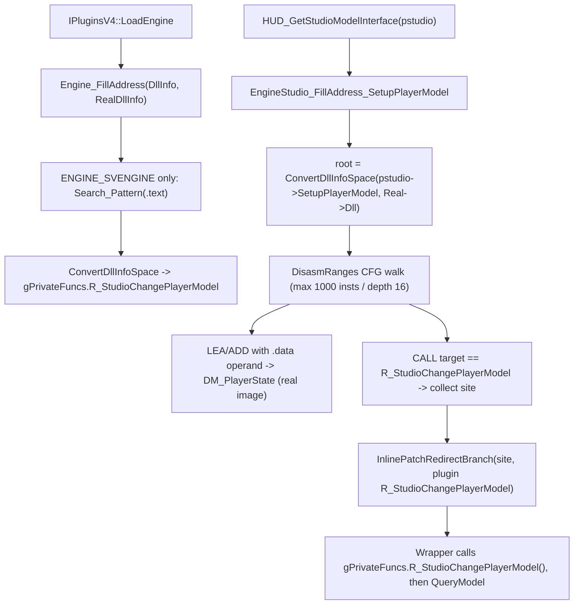

# Game-private symbols used by `SCModelDownloader`

This document inventories the unexported game symbols that `Plugins/SCModelDownloader` locates in the engine image and consumes. Symbol names are the plugin's local fields; the parenthetical names describe the inferred engine-side role rather than official debug-symbol names. Unlike the other `privatevars` notes, this plugin is **not** gamedata-based: it still uses a `.text` signature and a bounded control-flow disassembly walk.

## Scope and shared resolution process
- The scope covers three located items: the private function `R_StudioChangePlayerModel`, the private global array `DM_PlayerState`, and the `SetupPlayerModel` -> `R_StudioChangePlayerModel` call sites that get redirected. The plugin dereferences no other private slot, vtable, or global.
- Out of scope: the `HUD_*` export-table takeover (`IPluginsV4::LoadClient`), and the `serverbrowser.dll` -> `steam_api.dll!SteamAPI_Shutdown` IAT hook (`ServerBrowser_InstallHook` / `DllLoadNotification`, a third-party DLL import rather than an engine-private symbol). The public interfaces `engine_studio_api_t` / `r_studio_interface_t` are used as anchors only.
- Public MetaHook APIs, saved engine interfaces, and ordinary plugin state (for example `g_EngineDLLInfo`, `g_MirrorEngineDLLInfo`, `g_iEngineType`, `g_dwEngineBuildnum`) are excluded.
- **No gamedata**: there is no `ResolveGameSymbol` / `IsGameSymbolAvailable` call, no gamedata symbol diagnostic, and no `METAHOOK_API_VERSION` `static_assert` in this plugin. `scripts/validate-gamedata.py` gates no SCModelDownloader symbol.
- Two address spaces are in play. `IPluginsV4::LoadEngine` passes `g_MirrorEngineDLLInfo.ImageBase ? g_MirrorEngineDLLInfo : g_EngineDLLInfo` as the scan space (`DllInfo`) and `g_EngineDLLInfo` as the runtime space (`RealDllInfo`); `HUD_GetStudioModelInterface` passes the same pair to `EngineStudio_FillAddress`. Everything found by scanning is converted `DllInfo` -> `RealDllInfo` through the plugin-local `ConvertDllInfoSpace` before being stored or used as a hook target.
- Timing: `Engine_FillAddress` resolves the private function during `LoadEngine`; the `SetupPlayerModel` walk runs later, when the engine calls `HUD_GetStudioModelInterface`. Every miss is fatal through `Sys_Error` (`Sig_FuncNotFound` / `Sig_VarNotFound` / `Sig_NotFound`), so the plugin either resolves everything or aborts.

## Private functions

| Local symbol / inferred game symbol | Declaration location | Resolution mechanism | Subsequent use |
| --- | --- | --- | --- |
| `gPrivateFuncs.R_StudioChangePlayerModel` (`R_StudioChangePlayerModel`, the engine's per-entity player-model application routine, called from `StudioDrawModel` / `StudioDrawPlayer` per the in-source disassembly comment) | `Plugins/SCModelDownloader/privatehook.h` (`private_funcs_t`), instance zero-initialized at `Plugins/SCModelDownloader/privatehook.cpp` | `Engine_FillAddress` runs only for `g_iEngineType == ENGINE_SVENGINE`: `Search_Pattern(R_STUDIOCHANGEPLAYERMODEL_SIG_SVENGINE, DllInfo)` scans `DllInfo.TextBase..+TextSize` with a 14-byte wildcard-`0x2A` pattern, then `ConvertDllInfoSpace(..., DllInfo, RealDllInfo)` yields the real-image VA. No string anchor, no reverse function-begin search, no gamedata. `Sig_FuncNotFound` is fatal. | Two consumers: the plugin's `R_StudioChangePlayerModel()` wrapper calls it as the original body after the call-site redirect, and the `SetupPlayerModel` walk compares in-image `CALL` targets against it to find the redirect sites. No inline hook is installed. |

## Private global variables

| Local symbol / inferred game object | Declaration location | Resolution mechanism | Subsequent use |
| --- | --- | --- | --- |
| `DM_PlayerState` (`DM_PlayerState[MAX_CLIENTS]`, the engine's per-client player-model state array; element stride `0x20C`) | `Plugins/SCModelDownloader/privatehook.h` (extern), defined at `Plugins/SCModelDownloader/privatehook.cpp` as `player_model_t(*DM_PlayerState)[MAX_CLIENTS]` | Located by `EngineStudio_FillAddress_SetupPlayerModel` (`Plugins/SCModelDownloader/exportfuncs.cpp`), not by `Engine_FillAddress`. The walk root is the public `pstudio->SetupPlayerModel` (real-image VA) converted to `DllInfo` space; a null root is fatal. A bounded `DisasmRanges` walk then accepts the first instruction matching either `LEA reg, [reg*scale + disp]` or `ADD reg, imm` whose displacement/immediate lies inside `DllInfo.DataBase..+DataSize`; the matched operand is converted to `RealDllInfo` space. `Sig_VarNotFound` is fatal. | Read and written by the plugin: `R_StudioChangePlayerModel` reads `[index-1].model` / `.name`, and `SCModel_ReloadModel` / `SCModel_ReloadAllModels` clear `name[0]` and `model` to force the engine to reload a player's model. |

## Redirected engine call sites

| Local state | Source and meaning | Use |
| --- | --- | --- |
| `SetupPlayerModel_SearchContext::addr_call_R_StudioChangePlayerModel` (`std::set<PVOID>`) | Real-image VAs of `CALL rel32` instructions encountered by the walk whose immediate target, converted to `RealDllInfo` space, equals `gPrivateFuncs.R_StudioChangePlayerModel`. | An empty set is fatal (`Sig_NotFound(call_R_StudioChangePlayerModel)`); otherwise each address is passed to `g_pMetaHookAPI->InlinePatchRedirectBranch(addr, R_StudioChangePlayerModel, NULL)`. |
| `SetupPlayerModel_SearchContext::addr_call` (`std::set<PVOID>`) | Real-image VAs of every in-image `CALL` the walk sees, regardless of target. | Gate only: the `DM_PlayerState` pattern match is restricted to instructions visited before the first in-image call is recorded, which is what fixed the invalid `DM_PlayerState` address (commit `749067d3`). |
| `SetupPlayerModel_SearchContext::{code, branches, walks}` | Walk bookkeeping: visited instructions, already-queued branch targets, and the pending `(address, len, depth)` work list seeded with `(SetupPlayerModel, 0x1000, 0)`. | Bounds the walk: `max_insts = 1000` visited instructions, `max_depth = 16` branch levels; scanning of a window stops at `RET`, `0xCC`, an unconditional `JMP`, or a repeated instruction. |

## Architecture

## Dependencies
- `Plugins/SCModelDownloader/plugins.cpp` - builds `g_EngineDLLInfo` / `g_MirrorEngineDLLInfo`, calls `Engine_FillAddress` / `Engine_InstallHook`, and installs the `HUD_GetStudioModelInterface` replacement.
- `Plugins/SCModelDownloader/exportfuncs.cpp` - runs the `SetupPlayerModel` walk, redirects the call sites, and consumes `DM_PlayerState`.
- MetaHook APIs `SearchPattern`, `DisasmRanges`, `InlinePatchRedirectBranch`, `GetSectionByName`, `GetEngineBase` / `GetEngineSize`, `GetMirrorEngineBase` / `GetMirrorEngineSize`, `GetEngineType`, `GetEngineBuildnum`, `SysError`.
- Capstone `cs_insn` fields (`id`, `detail->x86.op_count`, `operands[].type/imm/mem.{base,disp,scale}`) inside the walk callback.
- Public `engine_studio_api_t::SetupPlayerModel` (walk root) and `r_studio_interface_t`.

## Notes
- `Engine_InstallHook` is a no-op: the inline hook on `R_StudioChangePlayerModel` is commented out because only 4 prologue bytes are available (`push esi; xor edx, edx; push edi`). Interception happens exclusively through the `E8` call-site redirects, so only the `SetupPlayerModel` caller is affected.
- `Engine_UninstallHook`, `EngineStudio_InstalHooks`, `ClientStudio_FillAddress`, and `ClientStudio_InstallHooks` are empty stubs: the branch redirects are never restored, which is harmless because the engine image is reloaded per process.
- `InlinePatchRedirectBranch` is called with `pOrginalCall == NULL`; the original body is reached through `gPrivateFuncs.R_StudioChangePlayerModel()` inside the wrapper rather than through a per-site trampoline.
- The signature is SVEngine-only. On any other engine type `gPrivateFuncs.R_StudioChangePlayerModel` stays null and `Sig_FuncNotFound` aborts the load, so this plugin does not run outside Sven Co-op.
- `LEA` acceptance has an operator-precedence quirk: the source reads `(disp in .data && mem.base != 0 && mem.scale == 1) || mem.scale == 4`, so a `lea reg, [reg*4 + disp]` is accepted without the `.data` range check and without requiring a non-zero base. The `ADD reg, imm` branch always requires `imm` inside `.data`.
- `player_model_t` is a local re-declaration of the engine layout: `char name[260]; char modelname[260]; model_t* model;` = `0x20C` bytes, matching the `imul ..., 20Ch` stride visible in the `SetupPlayerModel` disassembly comments. The plugin only reads `name` / `model`; `modelname` is never touched.
- `GetVFunctionFromVFTable` (`Plugins/SCModelDownloader/privatehook.cpp`) is declared and defined but has no caller in this plugin - dead helper.
- History: the `addr_call` gate that limits the `DM_PlayerState` search to the region before `SetupPlayerModel`'s first in-image call was added in commit `749067d3` ("Fix invalid address DM_PlayerState").

## Callers
- `IPluginsV4::LoadEngine` (`Plugins/SCModelDownloader/plugins.cpp`) calls `Engine_FillAddress` and `Engine_InstallHook`.
- `HUD_GetStudioModelInterface` (`Plugins/SCModelDownloader/exportfuncs.cpp`), installed as a `cl_exportfuncs_t` replacement, calls `EngineStudio_FillAddress` and then the original export.
