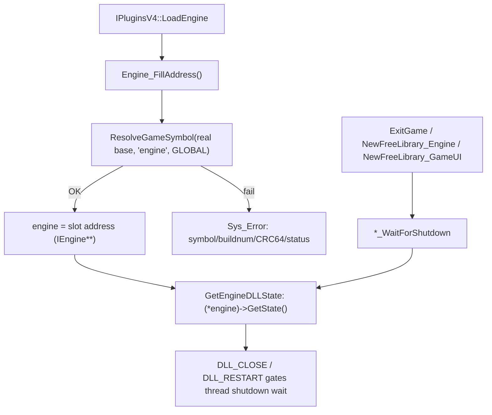

# Game-private symbols used by `ThreadGuard`

This document inventories the unexported game symbol that `Plugins/ThreadGuard` locates in the engine image and consumes: the engine module's global `IEngine*` slot (`engine`). The plugin resolves **no** game-private function, patches no engine instruction, and installs no engine-side hook. Since issue #855 (2026-09-09) the location is **gamedata-only**; the former `"Sys_InitArgv( OrigCmd )"` string anchor, push/call pattern, build-4554 fallback and bounded disassembly scan are deleted.

## Scope and shared resolution process
- The scope covers the single game-private global slot `engine` (`IEngine**`) located by `Engine_FillAddress` (`Plugins/ThreadGuard/privatehook.cpp`).
- Out of scope: the `kernel32` `CreateThread` / `WaitForSingleObject` / `Sleep` IAT hooks and the `FreeLibrary` IAT hooks (`Plugins/ThreadGuard/ThreadManager.cpp` and `privatehook.cpp`), the `_restart` command hook (`EngineCommand_InstallHook` via the public `FindCmd` / `HookCmd`), and the export-table work - none of these touch an engine-private address. `IEngine` itself is the public engine interface declared in `include/Interface/IEngine.h`.
- Public MetaHook APIs, saved engine interfaces, and ordinary plugin state (for example `g_EngineDLLInfo`, `g_iEngineType`, `g_dwEngineBuildnum`) are excluded.
- **gamedata-only**: `Engine_FillAddress(void)` calls `g_pMetaHookAPI->ResolveGameSymbol(g_EngineDLLInfo.ImageBase, "engine", MH_GAMESYMBOL_KIND_GLOBAL, &address)` against the **real** engine module base (`g_EngineDLLInfo.ImageBase` = `GetEngineBase()`), so the mirror image and the plugin-local `ConvertDllInfoSpace` are no longer involved. `privatehook.cpp` carries `static_assert(METAHOOK_API_VERSION >= 109, ...)`; `scripts/validate-gamedata.py` gates `engine` as a common required global.
- Failure is fatal and specific: a non-`MH_GAMESYMBOL_OK` status prints `Failed to resolve "engine"` with buildnum, CRC64 (when `GetModuleCRC64` succeeds) and `GetGameSymbolStatusString`, then aborts via `Sys_Error`. The old silent-null + trailing `Sys_Error("CEngine not found")` path is gone.

## Private global variables

| Local symbol / inferred game symbol | Declaration location | Resolution mechanism | Subsequent use |
| --- | --- | --- | --- |
| `engine` (address of the engine module's global `IEngine*` slot, i.e. `IEngine**` as stored; the `IEngine` vtable is the public one from `include/Interface/IEngine.h`) | `Plugins/ThreadGuard/privatehook.cpp` (file-scope `IEngine** engine = NULL;`) | `Engine_FillAddress`: `ResolveGameSymbol(..., "engine", MH_GAMESYMBOL_KIND_GLOBAL, &address)`; the gamedata `gv_va` is the slot address itself (the recorded anchor instruction is the `mov ds:engine, eax` store), so no dereference is applied. | `GetEngineDLLState()` dereferences it once (`(*engine)->GetState()`) and compares the result against `DLL_CLOSE` / `DLL_RESTART`; consumed by `Engine_WaitForShutdown`, `ServerDLL_WaitForShutdown`, and `ServerBrowser_WaitForShutdown`. |

## Resolution chain

1. **Resolve.** `Engine_FillAddress` (called from `IPluginsV4::LoadEngine` after `g_EngineDLLInfo.ImageBase` is set) resolves the GLOBAL `engine` with expected kind `MH_GAMESYMBOL_KIND_GLOBAL`.
2. **Diagnose.** On failure, report plugin-scoped `Sys_Error` with symbol name, `g_dwEngineBuildnum`, optional CRC64 and the status string; then return (the process aborts).
3. **Store.** `engine = (decltype(engine))address;` - the value is the **slot address**, not the `IEngine*` object.
4. **Consume.** `GetEngineDLLState()` performs the single dereference `(*engine)->GetState()`.

## Architecture

## Plugin-owned state

| Local state | Source and meaning | Use |
| --- | --- | --- |
| `g_ThreadManager_Engine` / `_GameUI` / `_ServerBrowser` / `_ServerDLL` | One `CThreadManager` per tracked module, created in `Engine_InstallHook` / `GameUI_InstallHook` / `ServerBrowser_InstallHook` / `ServerDLL_InstallHook`. | Owns the kernel32 IAT hooks and the tracked thread handles; not engine-private addresses. |

## Dependencies
- `Plugins/ThreadGuard/plugins.cpp` - sets `g_EngineDLLInfo.ImageBase` (only that field is populated now), calls `Engine_FillAddress()`, registers `DllLoadNotification`, and calls `Engine_WaitForShutdown` from `ExitGame`.
- `Plugins/ThreadGuard/privatehook.cpp` - performs the resolution and consumes `engine` in `GetEngineDLLState`.
- MetaHook APIs `ResolveGameSymbol` / `GetModuleCRC64` / `GetGameSymbolStatusString` (gamedata), `IATHook` / `BlobIATHook` / `UnHook`, `RegisterLoadDllNotificationCallback`, `GetGameDirectory`, `GetEngineModule` / `GetBlobEngineModule`, `ModuleHasImport` / `ModuleHasImportEx`, `FindCmd` / `HookCmd`.
- Public `include/Interface/IEngine.h` - the `GetState` vtable slot (index 3, after `Load` / `Unload` / `SetState`) the plugin calls.

## Notes
- The located value is the **address of the global `IEngine*` slot**, not the `IEngine*` itself; that is why the plugin stores `IEngine**` and dereferences exactly once in `GetEngineDLLState`. The code guards `engine != NULL` but assumes `*engine` is non-null.
- `Engine_FillAddress` signature changed from `(const mh_dll_info_t&, const mh_dll_info_t&)` to `(void)`; `g_MirrorEngineDLLInfo`, the `.text`/`.data`/`.rdata` section setup and `GetSectionByName` usage were removed from `plugins.cpp`, and `plugins.h` no longer declares `g_MirrorEngineDLLInfo`.
- Deleted by #855: `private_funcs_t` / `gPrivateFuncs` dead scaffolding, `ConvertDllInfoSpace`, `GetVFunctionFromVFTable`, the `Sys_InitArgv_SearchContext` + 0x50-byte `DisasmRanges` window, the `MOV reg, [disp32]` operand filter, the build-4554 `push`-only fallback, the `#include <capstone.h>` dependency, and the misleading `gl_backbuffer_fbo` comment. The no-argument `Engine_InstallHook()` / `Engine_UninstallHook()` declarations were removed from `privatehook.h` (the parameterized definitions used by `DllLoadNotification` remain).
- Thread management behaviour is unchanged: `DLL_CLOSE` / `DLL_RESTART` gating, exit/restart waits, `FreeLibrary` interception, DLL load notifications and IAT / BlobIAT hooks all keep their previous semantics.
- Verified 2026-09-09: `ThreadGuard.dll` (Release | Win32) contains no `Sys_InitArgv( OrigCmd )` / `CEngine not found` / `gl_backbuffer` strings; `engine` is the only gamedata symbol it resolves.

## Callers
- `IPluginsV4::LoadEngine` (`Plugins/ThreadGuard/plugins.cpp`) calls `Engine_FillAddress()`.
- `DllLoadNotification` (registered in `LoadEngine`) drives `Engine_InstallHook` / `Engine_UninstallHook` on engine and target-DLL load/unload.
- `IPluginsV4::ExitGame`, `NewFreeLibrary_Engine`, and `NewFreeLibrary_GameUI` reach `GetEngineDLLState()`, the only consumer of the located `engine` slot.

Related: [[game-data]] [[thread-guard]] [[private-symbols-disasm-workflow]]
